<!-- Please do not change this logo with link -->

# Blink Using Integrated Logic
This MPLAB X Melody code example shows how to make an LED blink using the Configurable Custom Logic (CCL) found in the AVR® DB. 

The CCL is configured as a toggling J-K flip-flop, also known as a T flip-flop. While a regular J-K flip-flop has two inputs and a clock signal that toggles the output on rising edges, the T flip-flop only uses a clock signal to toggle and has no other inputs. To achieve this, the J and K input needs to be set to constant logical '1'.

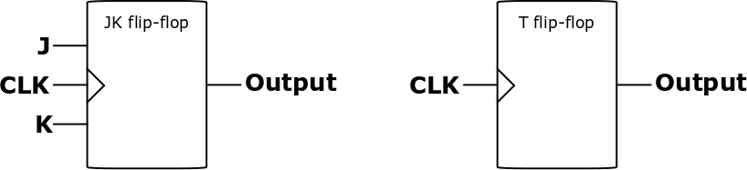

An internal clock signal can be used for the toggling, but it will toggle the output so fast that the blinking of an LED will appear as an LED that is always on. To get a more reasonable time between blinks, an alternative is to use the AVR event system.
The event system needs a generator to generate the event, and a peripheral to make use of the event. In this example, a timer will trigger an event each time the timer overflows. The event will then be used as the clock input for the T flip-flop. This way makes it easier to set a specific time between each blink. 

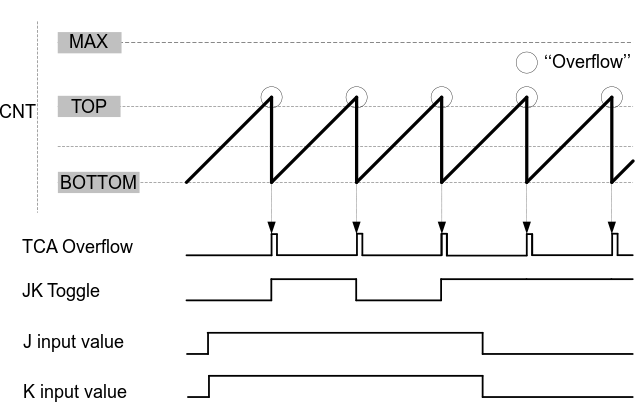

## Related Documentation

- [MPLAB Code Configurator](https://www.microchip.com/en-us/development-tools-tools-and-software/embedded-software-center/mplab-code-configurator)
- [AVR DB Family Product Page](https://www.microchip.com/en-us/products/microcontrollers-and-microprocessors/8-bit-mcus/avr-mcus/avr-db)
- [AVR128DB48 Hardware User Guide](https://www.microchip.com/DevelopmentTools/ProductDetails/PartNO/EV35L43A)
- [AVR128DB48 Datasheet](https://ww1.microchip.com/downloads/en/DeviceDoc/AVR128DB28-32-48-64-DataSheet-DS40002247A.pdf)

## Software Used

- [MPLAB® X IDE](http://www.microchip.com/mplab/mplab-x-ide) **5.45** or newer 
- [MPLAB® XC8](http://www.microchip.com/mplab/compilers) **2.31** or a newer compiler 
- [MPLAB® Code Configurator (MCC)](https://www.microchip.com/mplab/mplab-code-configurator) **4.1.0** or newer 
- [MPLAB® Melody Library](https://www.microchip.com/mplab/mplab-code-configurator) **1.37.26** or newer 
- [Microchip AVR-Dx Series Device Support](https://packs.download.microchip.com/) **1.7.98** or newer

## Hardware Used

- [Microchip AVR128DB48 Curiosity Nano Evaluation Kit](https://www.microchip.com/DevelopmentTools/ProductDetails/PartNO/EV35L43A)

## Setup

MCC with the Melody library was used to implement this example, once downloaded and opened in MPLAB X, it only requires the project to be built and flashed to an AVR DB Curiosity nano device.

To change configurations in MCC, simply push the MCC icon in MPLAB X, and wait for MCC to start.

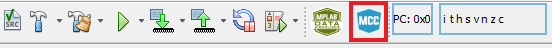

## Operation

The configurations in MCC for this example, are demonstrated and explained below. In this example, the three peripherals CCL, TCA timer, and the Event System are added and configured.

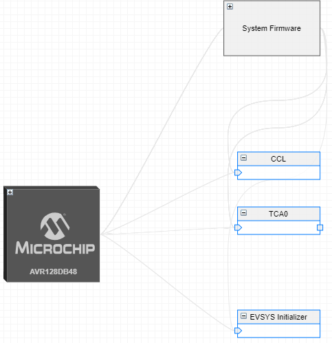

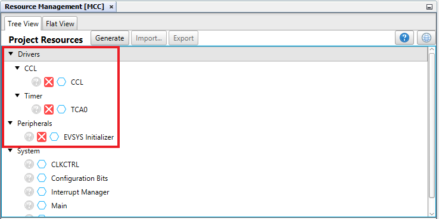

### __Setting up the CCL:__

1.	Add CCL from _“Drivers”_ in the _Device Resources_ list by pressing the corresponding green cross.
    
    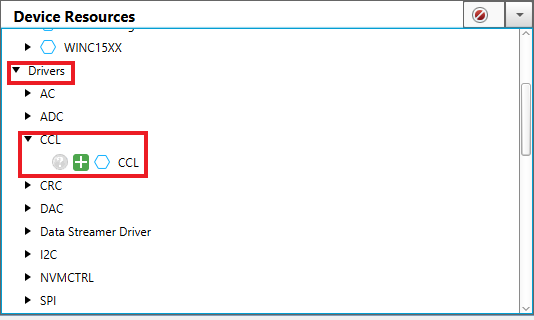
2.	Enable the CCL.

    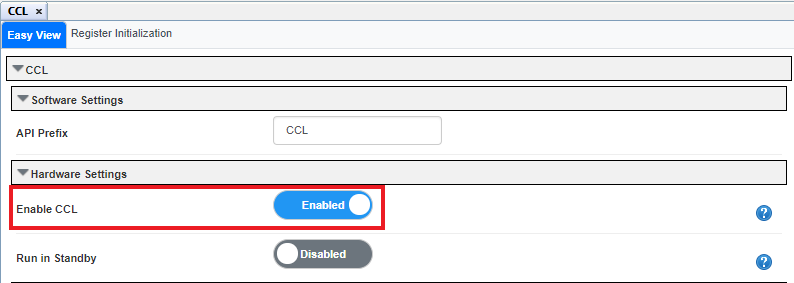

3.	Go into the CCL GUI and choose the LUTs to use. Each LUT can be configured by pressing the related cogwheel.

    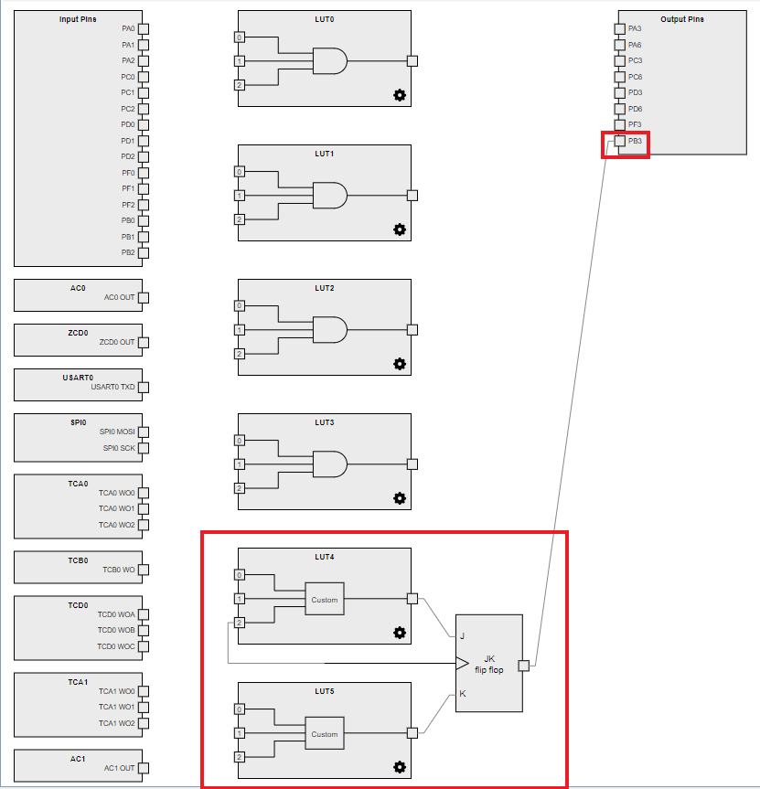

4.	In this example, we want to use a JK flip-flop as a T flip-flop.
5.	We need two LUTs for the J and K input.
6.	The two inputs need to be constant 1 so we use a custom logic set to 0xFF.

    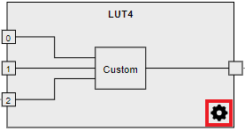

7.	We want the T flip-flop to be triggered by an event instead of a clock.
8.	To get an event as an input for the clock, one of the logic inputs needs to be set as the new clock signal. 
9.	We here set it to be IN2.
10.	In the logic gate, we choose IN2 to be one of the event channels, EVENTA.

    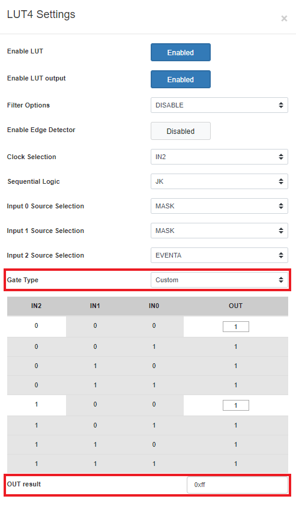

11.   Enable LUT and LUT output in the two chosen LUTs.
12.	We want the toggling to happen to a specific pin. This pin will be used to toggle an LED. This will affect the LUTs you use. In our case, the PB3 pin is preferable because it has an LED connected to it for the CNANO. We therefore use LUT4 and LUT5.
13.  Connect the output of the JK flip flop to the output pin. To connect an output in MCC, press the output and drag it to the selected output pin.

### __Setting up the TCA timer:__
1.	Add the TCA0 from the _Timer_ list, found under _“Drivers”_ in the _Device Resources_ list.

    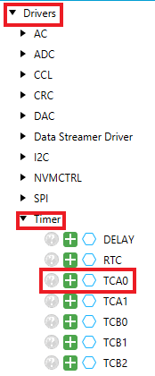

2.	Open the TCA tab.

    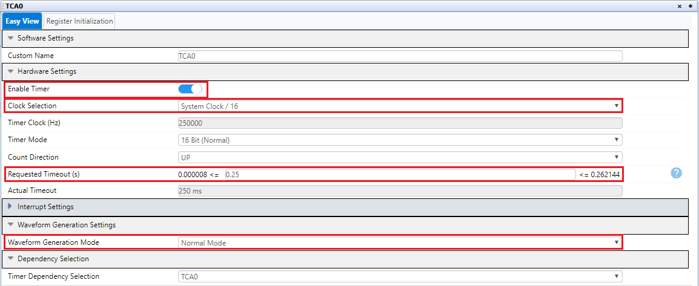

3.	Enable TCA.
1.  __Choose a clock selection.__ Bigger divisions of the System clock give a slower clock which allows for longer delays. We have chosen _"System Clock / 16"_.
2.  __Choose count direction.__ We have chosen UP count.
3.  __Choose the Waveform generation mode.__ We have chosen the default, "_Normal Mode_".     
4.  __Choose the desired clock time between each overflow.__ We have chosen 0.25 seconds, this is the time between overflows, meaning an event will trigger every 0.25s. The T flip flop will therefore toggle the LED every 0.25s.        

    
### __Setting up the Event system:__
1.	Open the Resource management tab.

    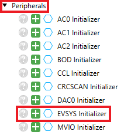

2.	Add the EVSYS initializer from _“Peripherals”_ in the _Device Resources_ list.
3.	Open the EVSYS initializer tab.

    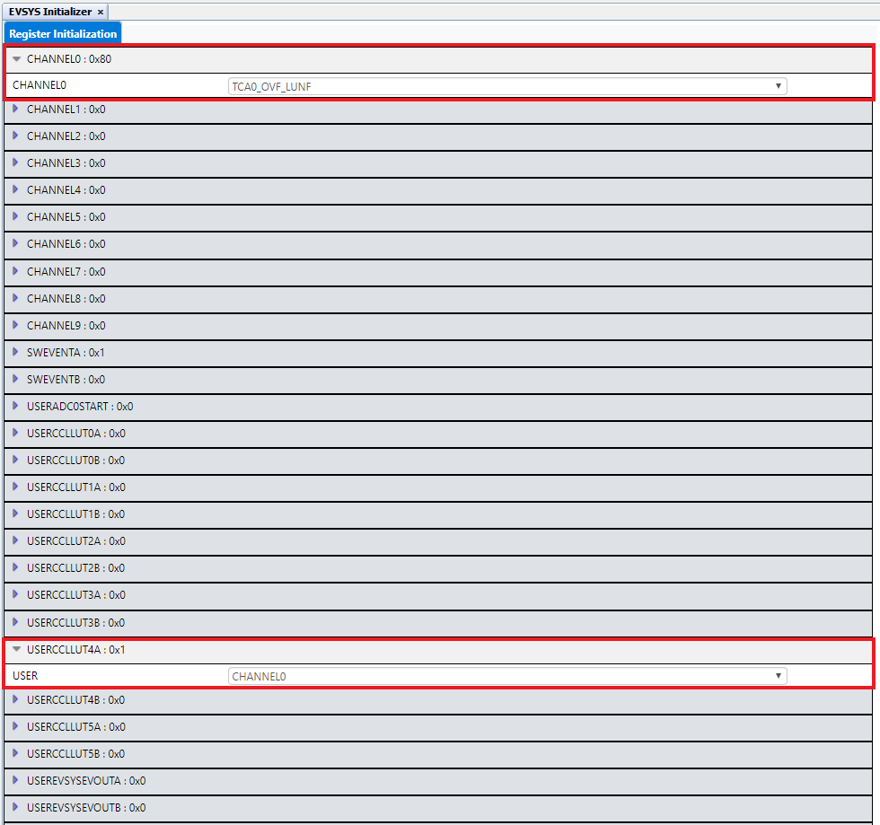

4. __Set the generator__. We use the TCA to generate an event on each overflow. We choose this in MCC by setting one of the channels, _CHANNEL0_ to _TCA0_OVF_LUNF_ . 

    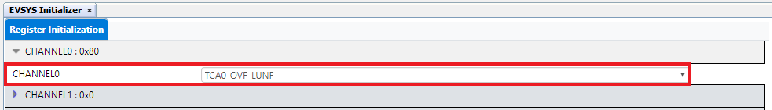

5. __Set the user__. When configuring the CCL, event channel A (EVENTA) was used as an input for LUT4. To set LUT4 as the user of the event, select USERCCLLUT4A, and set it to the same channel as the generator, CHANNEL0. 

    

Once all configurations are complete the code needs to be generated. Go to the _Resource Management [MCC]_ tab, and click on the _Generate_ button to generate the code. 

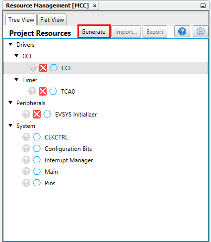

Build the code and flash your device.

If build and flashing were successful the LED on the board should start blinking with 0.25s intervals.

## Conclusion

After going through this example you should be able to make an LED blink, and be more familiar with how to:
- Configure the Timer to generate an overflow event
- Configure the Event System to route a Timer overflow event to CCL
- Configure the CCL JK flip-flop with constant inputs, and an overflow event as the clock